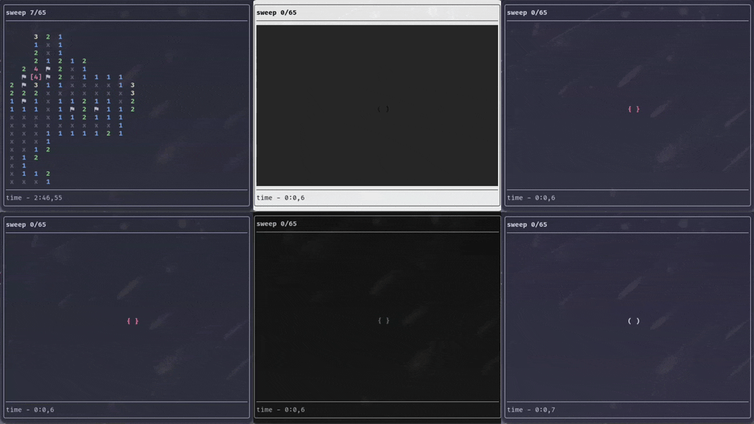
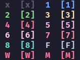
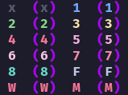
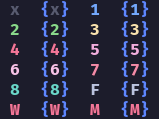

# sweep

A flexible minesweeping experience in your terminal emulator



## Why does it exist?

I've started enjoying using the terminal and I like playing minesweeper. 

I wanted a TUI minesweeper that is both pretty and configurable but could not find one.
So I built something that I would enjoy.

Hope you like it as well :D

## Prerequisites

Having a [nerd font](https://www.nerdfonts.com/) is optional but recommended so you could use different glyphs instead of only [ASCII](#ascii)

## Installation

To install [sweep](#sweep) run script dedicated to your system

### Windows

```powershell
irm https://raw.githubusercontent.com/erokez0/sweep/master/install.ps1 | iex
```

### Linux / MacOS / BSD

```sh
curl -fsSL https://raw.githubusercontent.com/erokez0/sweep/master/install.sh | bash
```

## How to play

If you are not familiar with [minesweeper](https://en.wikipedia.org/wiki/Minesweeper_(video_game)), 
It's a game where you are presented to a field of tiles where each may hide a mine or not. 
If the tile does not contain a mine, that it contains the number of mines around it

If you are using the [default config](#default-config-file), which you are if you haven't tweaked it yet, then It's pretty straightforward:

WASD or <span title="hjkl">VIM keys </span> to move the cursor around

`z` or `enter` to open the tile by revealing it's contents

> [!NOTE]
> If you want to open all non-flagged tiles around the cursor 
> just open the tile twice

`x` or `\` to set a flag on the tile

## Configuration

This chapter is all about the configuration of your experience

All of your configuration is stored like this

```
# For windows
C:/Users/user/AppData/Roaming/sweep/
├── config.default.json
├── config.json
└── config.schema.json

# For UNIX-based system
~/.config/sweep
├── config.default.json
├── config.json
└── config.schema.json
```

### Configuration file

Configuration file for [sweep](#sweep) is a JSON file conforming to the [schema](#config-schema) or left blank to use all baked in defaults

> [!WARNING]
> The config file is required for the application to work.

When the config file does not exists or contains errors you will be alerted

For example if you try to run the app with no config.json you will get this message

```
Could not read config /home/user/.config/sweep/config.json
Does the file exist?
```
#### Options

Here is a list of all possible options to configure

> [!NOTE]
> $schema field is not required but helpful if you have a JSON LSP


##### Flags

The `flags` field takes in a list of [flags](#flags-1) that you might want to set permanently (for example the [fill](#fill) flag!).
Find out more about [flags](#flags-1).

---

#####  Colors

Here you can set a color for every possible tile (0-9, mine, wrong flag, flag, empty)

The value should be a string containing a HEX RGB, an ANSI color or null for default.

Some examples of valid color options

| HEX       | ANSI | color |
| --------- | ---- | ----- |
| #FF       | 15   | white |
| #00       | 0    | black |
| #FF0000 | 8    | red   |

> [!NOTE]
> ANSI colors are preferred because your terminal emulator can change them with it's own theme.
> So if you change the theme You won't need to update you config
> 
> I recommend checking [this website](https://hexdocs.pm/color_palette/ansi_color_codes.html) to pick some ANSI colors 

The default values are the sames as in [default config file](#default-config-file)

The value is applied as the foreground color or the background color if the [fill](#fill) flag is set

---

##### Defaults

These options set the default value for corresponding input at the start screen

- `mines` - amount of mines on the field
- `width` - the width of the field in rows
- `height` - the height of the fields in columns

All of them accept a value of an unsigned 16 bit integer (0-65535) or can be left null to use 0 as the default value

---

##### Bindings

These options set desired inputs for said actions

- `flag tile` - the action of setting a flag on a tile under the cursor
- `open tile` - the action of revealing the contents of a tile under the cursor

These correspond to the action of moving the cursor to the corresponding direction by 1 step

- `move cursor down`
- `move cursor up`
- `move cursor right`
- `move cursor left`

The value for each option is list of keys or combinations of them. Those include any character from the keyboard and special keys like ctrl, backspace, enter, alt, shift, etc

---

##### Cursor

These options are for cursor customization so the focused tile is highlighted the way you want it to be

The `color` option is the same as for the [colors options](#colors).
The default for `color` is the color of the foreground of the tile

And we have the `left half` and the `right half`.
Here you can set any character to be on the left or the right side of the tile content (the number or the flag)

###### Some examples







---

##### Permanent defaults

If you know what `mines`, `height` and `width` options you want to stick its possible to set them permanently.

These options are set directly in the [config](#configuration-file) as keys

- mines
- height
- width

For each of them there may be set an unsigned 16 bit integer (0-65535) or null (which is weird and only used for an example in the [default config](#default-config-file))

---

##### Glyphs

These options lets you control what character or glyph is used for each tile type.
You can set any one character as a value for each key of tile type.

For example:

By default `0` tile, that tell you that there are no mines around it use "x". But you can change it setting the key of "0" in the glyphs section of the config to a preferred glyph.

---

#### Location

The location of the config file depends on your operating system.

For Windows it is `C:/Users/user/AppData/Roaming/sweep/config.json`

And for UNIX-based OSs it is `~/.config/sweep/config.json`

#### Default config file

The default config file only serves a purpose as en example of how you may configure your experience.

> [!NOTE]
> You are not supposed to change the default config file
>
> It is there only to copy and only then modify


```JSON
{
  "$schema": "./config.schema.json",

  "flags": [
    "--ascii"
  ],
  
  "colors": {
    "0": "8",
    "1": "12",
    "2": "10",
    "3": "3",
    "4": "9",
    "5": "13",
    "6": "5",
    "7": "1",
    "8": "14",
    "mine": "9",
    "wrong flag": "9",
    "flag": "15",
    "empty": null
  },
  
  "mines": null,
  "height": null,
  "width": null,

  "defaults": {
    "mines": 0,
    "width": 0,
    "height": 0
  },

  "bindings": {
    "flagTile": [
      "x",
      "\\"
    ],
    "openTile": [
      "z",
      "enter"
    ],
    "moveCursorDown": [
      "j",
      "s"
    ],
    "moveCursorUp": [
      "k",
      "w"
    ],
    "moveCursorRight": [
      "l",
      "d"
    ],
    "moveCursorLeft": [
      "h",
      "a"
    ]
  },

  "cursor": {
    "color": null,
    "left half": "[",
    "right half": "]"
  }
}
```

This is how it would look if you launch [theme preview](#theme-preview)

```sh
sweep --preview
```


As you can see all possible fields are filled, `null` fields means the defaults baked into the program are going to be used

Keybinds in the example use the VIM keys for movement as well as WASD, z or enter for opening a tile and x or \ for setting a flag

---

### Config Schema

Config schema is a JSON file containing rules for how the [config.json](#config-file) should be filled out

> [!WARNING]
> The config file is required for the application to work.


---

### Flags

Flags are used to tweak the existing config temporarily 

Or for example seeing the path to the [`config.json`](#config-file) or preview your theme

> [!NOTE]
> All flags have short and long variations produce the same result

> [!NOTE]
> Flags are prioritized to the [`config.json`](#config-file)
> 
> e.g.
>
> `{ "mines": 100 }` and `--mines 125` are both provided
>
> the config module will always overwrite configuration from file to match provided flags


Now you can see all of the flags

---

#### ASCII

`--A` or `--ascii`

This flags changes the [nerd font](https://nerdfonts.com) glyphs to ASCII text.

| glyph      | ASCII |
| ---------- | ----- |
| flag       | F     |
| mine       | M     |
| wrong flag | W     |

---

#### Config file Path 

`--C` or `--config-path`

Will return the path to the [`config.json`](#config-file) file

##### Usage

Here is a way to edit the [config](#configuration-file) using neovim

```sh
nvim $(sweep --C)
```

Or if you just want to see the path
```sh
sweep --config-path
```
---

#### Copy default config

`--D` or `--default-config`

Copies the [default config](#default-config-file) file to the location of the [main config](#config-file-path)

---

#### Fill

`--F` or `--fill`

Will vary how the [colors](#colors) options affect the tiles

If the flag is used, then the color will apply to the background of the tile and the foreground will black for dark terminal and white for light terminal,
otherwise the color will apply to the foreground and the background will adapt to the background color of the terminal

#### Theme preview

`--P` or `--preview`

This flag is used to preview all the tiles with their colors after you've tweaked your color theme and/or cursor.

##### Usage

<pre>
$ sweep --P --A

<span style="color:grey">x  [x]</span><span style="color:blue">  1  [1]</span>
<span style="color:green">2  [2]</span><span style="color:olive">  3  [3]</span>
<span style="color:red">4  [4]</span><span style="color:purple">  5  [5]</span>
<span style="color:teal">6  [6]</span><span style="color:maroon">  7  [7]</span>
<span style="color:aquamarine">8  [8]</span><span style="color:white">  F  [F]</span>
<span style="color:aquamarine">W  [W]</span><span style="color:white">  M  [M]</span>
</pre>

---

#### Mines

`--M` or `--mines`

Sets the amount of mines, same as [permanent defaults](#permanent-defaults)
Requires an argument of an unsigned 16 bit integer (0-65535)

##### Usage

```sh
sweep --M 25
```

---

#### Height

`--H` or `--height`

Sets the field height, same as [permanent defaults](#permanent-defaults)
Requires an argument of an unsigned 16 bit integer (0-65535)

##### Usage

```sh
sweep --H 25
```

---

#### Width

`--W` or `--width`

Sets the field width, same as [permanent defaults](#permanent-defaults)
Requires an argument of an unsigned 16 bit integer (0-65535)

##### Usage

```sh
sweep --H 25
```

---

#### Help

`--help`

Prints out the help message that is pretty much useless if you have already read so much

## Build

This section is for those who would like to build sweep themselves

The only build dependency for sweep is [go](https://go.dev/).
So if you have go installed, the build process is pretty straightforward

```sh
go build
```


## Contribution

I am open for contribution, new ideas or issues 

